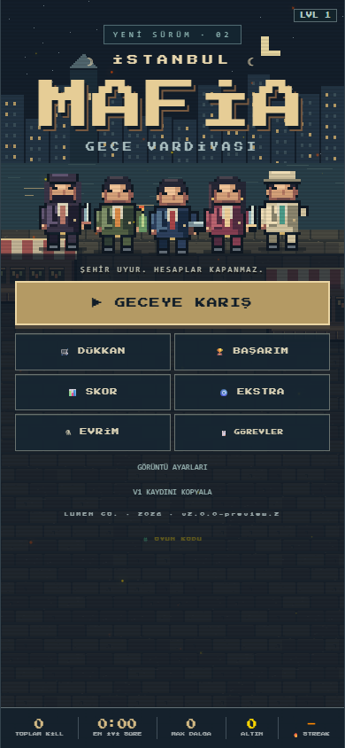
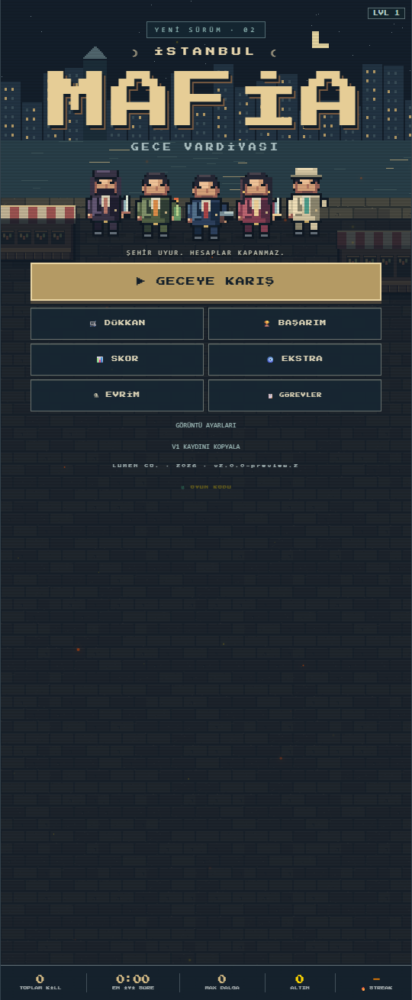
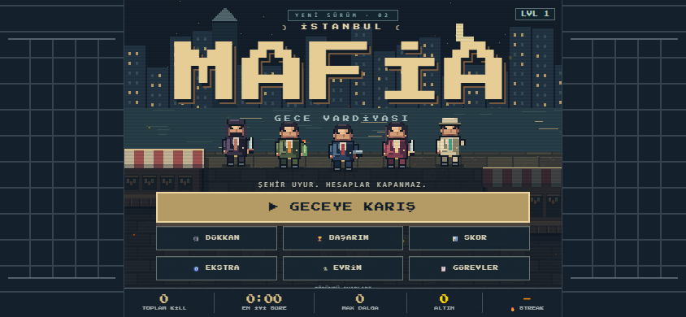

# İstanbul Mafia V2 — A/B test raporu

18 Eylül 2026 · 17 Eylül denetiminin devamı · **2.0.0-preview.2**

Kod V2 kaynak klasörüne uygulandı. A1–A7 ve B1–B2 uygulandı; aşağıdaki kabul kontrolleri tamamlandı. Commit/push yok. V1, unity/ ve android/ değiştirilmedi; APK/sync yapılmadı. C fazı uygulanmadı.

## Doğal oynanış akışı

Gerçek tarayıcı RAF döngüsü, görünür menü/kart tıklamaları ve klavye girdileri kullanıldı. Rota seçimi için durum yalnızca okundu; doğrudan gupdate çağrısı, can/hız değişikliği, kayıt enjeksiyonu veya hile yok. Bu, otomatik tarayıcı oynanışıdır; insanın telefon üzerinde yaptığı test olarak sunulmaz. Her deneme boş localStorage ile ayrı tarayıcı bağlamında başladı. Karakter USTURA, zorluk normal; bazı tekrar denemelerinde ekrandaki normal tur güçlerinden biri seçildi.

Son toplama düzeltmesinden sonra **16 yeni kayıt denemesi: 10 adet üç dakikalık başarı, 6 çatışma ölümü**. Başarısız denemeler saklandı; donma diye sınıflandırılmadı. Her haritada beş başarılı yeni kayıt elde edilene kadar tekrar edildi. Araştırma sırasında eski kodla yapılan denemeler bu toplama dahil değil.

| Harita / kayıt | Oyun süresi | Son seviye | Normal tur gücü | Kanıt |
|---|---:|---:|---|---|
| Üsküdar 1 | 180.192 sn | 3 | yok | [JSON](final-natural/natural-uskudar-4.json) |
| Üsküdar 2 | 180.112 sn | 4 | yok | [JSON](final-natural/natural-uskudar-2.json) |
| Üsküdar 3 | 180.048 sn | 6 | yok | [JSON](final-natural/natural-uskudar-1.json) |
| Üsküdar 4 | 180.080 sn | 4 | yok | [JSON](final-natural/natural-uskudar-5.json) |
| Üsküdar 5 | 180.192 sn | 5 | m_aura | [JSON](final-natural-retry/natural-uskudar-1.json) |
| Beşiktaş 1 | 180.160 sn | 4 | yok | [JSON](final-natural/natural-besiktas-5.json) |
| Beşiktaş 2 | 180.080 sn | 6 | yok | [JSON](final-natural/natural-besiktas-4.json) |
| Beşiktaş 3 | 180.016 sn | 5 | m_aura | [JSON](final-natural-retry/natural-besiktas-5.json) |
| Beşiktaş 4 | 180.160 sn | 4 | m_sniper | [JSON](final-natural-retry/natural-besiktas-4.json) |
| Beşiktaş 5 | 180.192 sn | 4 | m_time | [JSON](final-natural-retry/natural-besiktas-2.json) |

Bu 10 kayıtta: **doğuşta komutsuz yer değişimi 0 px, örneklenen çarpışma ihlali 0, JavaScript hatası 0, hile kapalı**. Görünmez katı obje problemi ortak geometri/çizim kontrolüyle ayrıca sınandı. [Tüm başarılı ve başarısız denemeler](acceptance-natural.json).

Denemelerin ortaya çıkardığı iki ek A hatası düzeltildi: öğretici oyuncuyu durdururken düşmanları çalıştırıyordu; modal sırasında oyun saati de durduruldu. XP/altın/can toplama kodu önceki V2'de çizim koduyla yer değiştirmişti; toplama ve seviye atlama yeniden güncelleme döngüsüne alındı, sıfır mesafede bölme korundu.

## Kontrollü testler

- **A1/A2:** 8 harita × 100 farklı üretimde çarpışmasız doğuş ve 0 px komutsuz hareket. Beşiktaş merkez sütunu tek objedir; doğuş ona göre seçilir. Üsküdar 38/38 yapısal duvar çizildi. Çizim, hareket ve doğuş aynı WorldRules.objects listesini kullanır; boyut eşiği yok.
- **A3:** gerçek gupdate temas senaryosunda dash hasarı 0. Zırh, süreli kalkan, kapasite tüketimi ve tek vuruş kalkanı ayrı doğrulandı. Tüm düşman kaynaklı oyuncu hasarı applyDamage üzerinden geçer.
- **A4:** blur sonrası keys değerlerinin tamamı false. Birincil dokunma id=7 iken ikinci parmak yönü değiştirmedi; id=7 kalkınca hareket sıfırlandı. Görünürlük, modal, pause ve yeni tur resetInput kullanır; modal testinde oyun saati farkı 0.
- **A5:** NPC, minimap ve ekran dışı ok çizimi çağrıları doğrulandı. [Kontrollü kurtarma görüntüsü](rescue-controlled.png).
- **Toplama:** aynı konumdaki XP ile +1 seviye, +17 altın, +14 can; üç nesne de dizilerinden kaldırıldı ve seviye kartları açıldı.
- **Kayıt uyumu:** eski karakter kimliği, açılan karakter listesi, istatistik alanı ve skor etiketi dönüştürüldü; altın korundu. localStorage anahtarları aynı. Eski kimliklerin Unicode geçiş tablosu yalnızca kayıt uyumluluğu içindir, arayüze çıkmaz.
- **A7:** yetkili www kaynaklarında istenen ad/ticari ifade taraması **0 eşleşme**. [Komut ve çıktı](A7-grep.txt). Değiştirilmemesi istenen Android gömülü kopyası bu taramanın dışında; ticari ekranlar kapalı. Şans çarkı ve kumar ikonları kaldırıldı.

Ayrıntı: [kontrollü sonuçlar](controlled.json), [dosya bütünlüğü](integrity.json), [değişiklik manifestosu](change-manifest.json). Karakter PNG'leri yalnızca yeniden adlandırıldı; dosya içeriği hash'leri aynı. Android portrait ayarı ve V1 www / Android kaynak hash'leri değişmedi.

## 180 düşman performansı — kontrollü, doğal oyundan ayrı

Masaüstü 12th Gen Intel(R) Core(TM) i5-12400F, Windows 10.0.26200, Edge 153.0.4234.32, 540×900. Tek test sayfası; Chrome tracing açık. 120 kare ısınma + 600 callback örneği; ana iş parçacığı için 599 kare aralığı. Update ölçümü ilk 125 güncelleme çağrısını dışarıda bırakır. Düşman sayısı tüm ölçüm boyunca 180; test oyuncusu ölümsüz ve düşmanların canı sabit sayıyı koruyacak kadar yüksek. Bu değişiklikler yalnızca test ortamında.

| Ölçüm | p95 |
|---|---:|
| Update | 2.60 ms |
| Tam oyun callback: update + draw + minimap + HUD + oyun zamanlayıcıları | 4.30 ms |
| Ana iş parçacığı kare yükü: callback + zamanlayıcı + layout/paint | **14.862 ms < 16 ms** |
| rAF sunum aralığı | 18.10 ms |

İç içe RunTask olayları bir kez sayıldı. 16 ms kabulü **CPU kare iş yükü** için geçiyor; monitör sunum aralığı veya GPU/compositor uçtan uca gecikmesi için aynı iddia yapılmıyor. Fiziksel Android performansı ölçülmedi.

Ayrışma gridinde yayılmış 180 düşman için 4.468 aday karşılaştırması, eski tam taramada 32.220 olurdu. 90/180/360/720 düşmanda 1.404/4.468/10.264/21.856 aday: benzer yoğunlukta yaklaşık doğrusal artış. Çok sıkışık kalabalıkta en kötü durum karesel kalır; bu ölçümde düşmanlar merkeze toplandığı için p95 aday sayısı 31916. Buna rağmen CPU kare bütçesi geçti.

[Ölçüm özeti](performance.json) · [Ham callback/update örnekleri](performance-samples.json) · [Ana iş parçacığı örnekleri](main-thread-frame-samples.json) · [Sıkıştırılmış tarayıcı izi](performance-trace.json.gz) · [180 düşman görüntüsü](performance-180.png)

## Ekran düzeni

Logo oranı, yatayda istenen 540 px oyun sahnesine göre ölçüldü. Logo alt kenarı–başlat üst kenarı aralığı kullanıldı.

| Görünüm | Sahne | Logo genişliği | Boşluk / ekran yüksekliği |
|---|---:|---:|---:|
| 390×844 | 390 px | %77.56 | %19.19 |
| 540×1310 | 540 px | %76.85 | %12.37 |
| 844×390 | 540 px | %76.85 | %24.62 |
| 932×430 | 540 px | %76.85 | %22.33 |

Tüm oranlar ≥%70 ve ≤%25 koşullarını sağladı. Yatayda sahne ortalı ve yan paneller statik. Duraklatma, dash, ulti, otomatik yetenek, minimap ve silah alanı ekran içinde. Küçük yatay ekranda uzun menü/modallar içeriden kaydırılabilir; son kontrolün erişimi test edildi. Yeni kart/özellik eklenmedi.

[390×844 oyun](game-390x844.png) · [540×1310 oyun](game-540x1310.png) · [844×390 oyun](game-844x390.png) · [932×430 oyun](game-932x430.png) · [Yerleşim ölçümleri](layout.json)

## Terminal için tekrar

Node, Edge ve Playwright gerekir. qa/ab/ altındaki ab-controlled.cjs, ab-layout-test.cjs, ab-natural.cjs ve ab-performance.cjs çalıştırılabilir. Playwright kurulu değilse PLAYWRIGHT_PATH ile mevcut modül yolu gösterilebilir; test yardımcısı Codex yerel çalışma zamanı yolunu da arar. Test kancası yalnızca yerel test sunucusunun cevabına eklenir, üretim index.html'inde bulunmaz. Doğal test tekrarlarında QA_MODIFIERS=1 görünür tur güçlerini seçer; QA_RUNS harita/adet JSON'u alır. Commit yok; Terminal doğrulamasına hazır.
